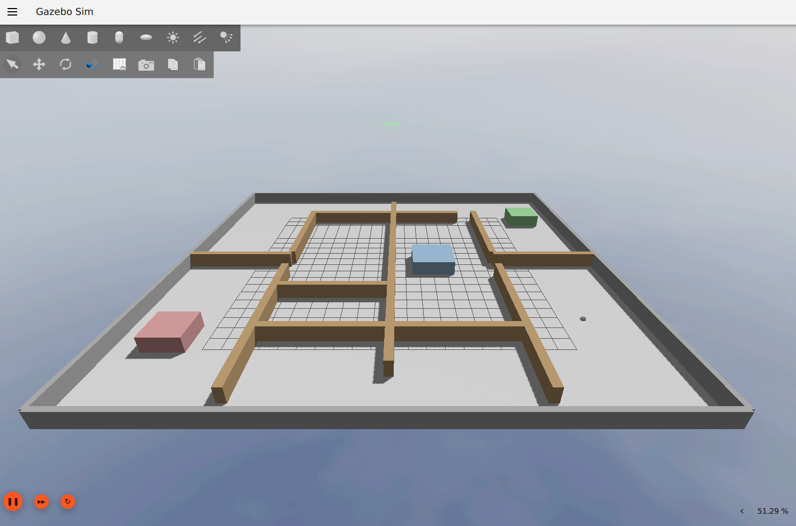
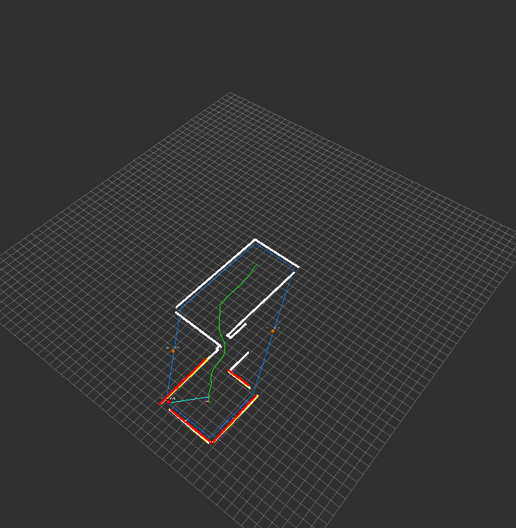
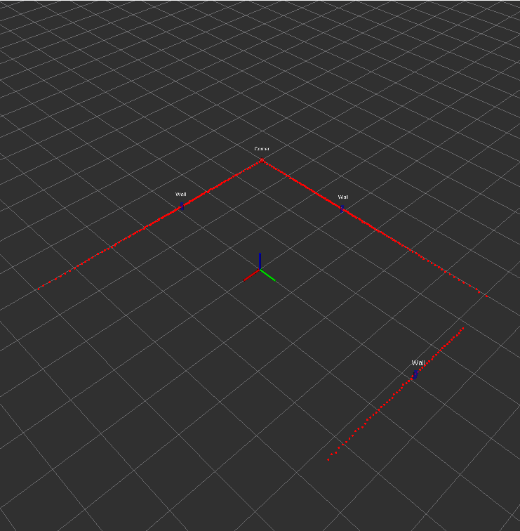
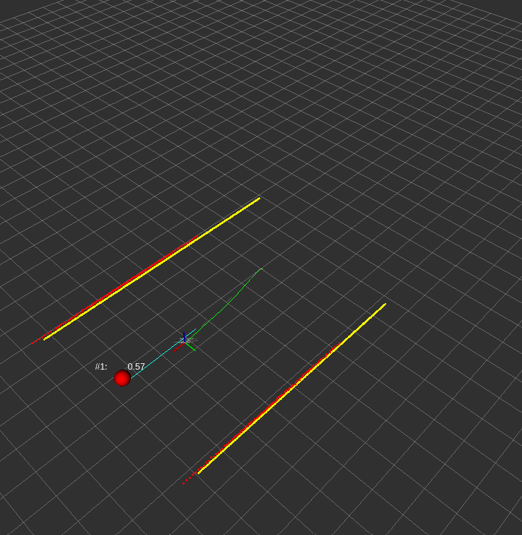
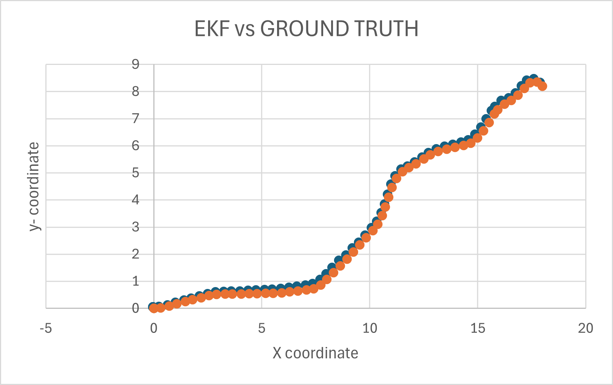

# Autonomous Robot Exploration with Feature-Based SLAM

A ROS 2 (Jazzy) system for autonomous exploration and mapping of unknown environments. A TurtleBot3 Waffle Pi robot navigates autonomously using frontier-based exploration, building a global map in real time through feature-based EKF-SLAM and ICP submap stitching — all simulated in Gazebo Harmonic.

## Prerequisites

- **ROS 2 Jazzy**
- **Gazebo Harmonic** (`ros-jazzy-ros-gz-sim`, `ros-jazzy-ros-gz-bridge`)
- **Python dependencies:** `numpy`, `scipy`, `scikit-learn`, `shapely`, `open3d`

```bash
# ROS 2 + Gazebo bridge
sudo apt install ros-jazzy-ros-gz-sim ros-jazzy-ros-gz-bridge ros-jazzy-robot-state-publisher ros-jazzy-rviz2

# Python
pip install numpy scipy scikit-learn shapely open3d
```

## Building

```bash
cd ~/thesis_ws
colcon build --symlink-install
source install/setup.bash
```

## Running

### Full autonomous exploration (default — maze world)

```bash
ros2 launch autonomous_exploration full_system.launch.py
```


## Environments & Results

### Simulation Environment

Gazebo Harmonic simulation with TurtleBot3 Waffle Pi in a structured maze environment.



---

### Generated Maps

The system progressively builds a global occupancy/point-cloud map as the robot explores. The convex hull of mapped points (blue) defines the exploration boundary. Frontier candidates (green) are sampled inside it, away from obstacles.

 |

---

### Detected Landmarks

Line-segment landmarks extracted from LiDAR scans and maintained in the EKF state.



---

### Local Submap

A single submap accumulated from 50 consecutive LiDAR scans, before global stitching.



---

### EKF Accuracy vs. Ground Truth

EKF-SLAM estimated trajectory (blue) versus Gazebo ground truth (red).

| EKF vs Ground Truth (combined) |
|  

---

## License

Apache-2.0
